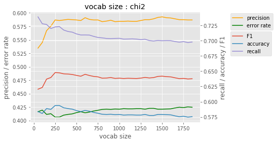
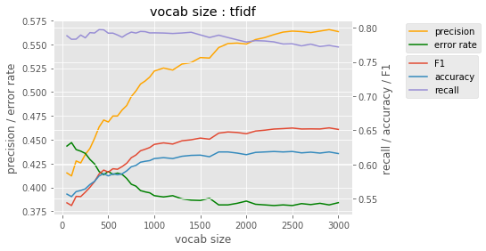
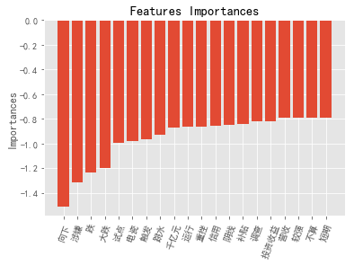
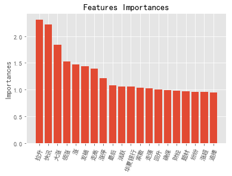
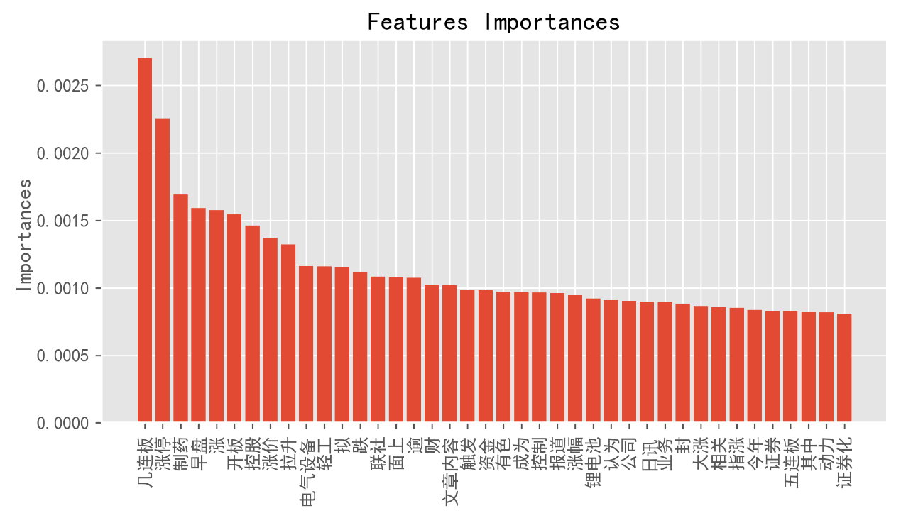

# Stock Market Prediction

## 1. Data description
-------------------

News.txt

Each line contains a single instance of news sample which is stored as data type
of dictionary.

Each sample of news has three fields: ID, title and content

Train.txt and Test.txt

These two files contain 7,954 and 3,000 instances for training and testing,
respectively.

Each instance contains several pieces of financial news related to a company
from a same day and the trend of the stock price resulted.

Stop_word.txt

Record the stop word which need to be deleted.

## 2. Data prepare
---------------

*make_data.py*

According each instance in train.txt, we have the id of news of the related
company, then, find all the news related the company in the news.txt, and
concatenate all the contents of news of one company by the function *content*,
and the data saved as a list named *new_train*. Now, the form of data is a list,
the first element is label, the second element is content of all the news.

The next step is do some preparation for the text data by applying the function
*del_stopword*, firstly use *jieba* package to cut the sentence into words, and
then delete the stop words (in the stop_word.txt) and some special symbols and
numbers (by applying the function *judge*)

After all the prepare process, save the data into *del_new_train.pkl* file for
the convenient of using rapidly in later steps.

Do the same process to make a test data, save into the *del_new_test.pkl* file.

## 3. Feature generate and build model
-----------------------------------

Here choice 4 different model for the text classification: Naïve Bayes, SVM,
logit regression, random forest. For different models, we applied different
features.

### 3.1 Naïve Bayes

*prediction_nb.py*

In Naïve Bayes, the origin vocab is too large, and not every word can contribute
to the classification, so we tried two different feature selection ways to
decide the final vocabulary.

Firstly, chi2 test was used to build a vocabulary in which word has a more
important influence for the classification of text (by applying *chi2*
function). Different vocabulary sizes were compared to test the model
performance. The vocabulary size is from 50 to 1800 chosen from the biggest
value of chi2 test, the result is as follow fig 3.1.1. We can see that as the
vocab size get larger, the precision and accuracy increased and error rate
decreased until the vocab size reached 250, and when the vocab size get larger
than 250, the performance get worse. So, we set the vocab size by chi2 is 250.
And the result is as follow table 3.1.1.

Fig 3.1.1

Secondly, we build a vocab depend on the weight of tf-idf of each word. We
choose the top n max tf-idf weight words to build our vocabulary. The result is
as follow fig 3.1.2. From the picture, the model preforms better when the vocab
size gets larger obviously. However, when the vocab size beyond 2000, the change
of rates gets much slower. For simplicity of model, we set the vocab size as
2000. And the result is as follow table 3.1.1.

Fig 3.1.2

Table 3.1.1

| feature       | Vocab size | recall | precision | accuracy | Error rate | F1    |
|---------------|------------|--------|-----------|----------|------------|-------|
| Tf-idf weight | 2000       | 0.772  | 0.563     | 0.616    | 0.384      | 0.651 |
| Chi2          | 250        | 0.723  | 0.587     | 0.594    | 0.406      | 0.648 |
| best          | 2000       | 0.772  | 0.563     | 0.616    | 0.384      | 0.651 |

Compare the two method, chi2 has a close performance to tf-idf, even with a much
smaller vocab size, which makes the Naïve Bayes model more efficient.

For the later three models, we use the tf-idf weight vector as the data feature
coincidently. Change the text data into numeric data, then, each instance is
represented by a vector (by apply *TfidfVectorizer* function). We set the
parameter as *min_df = 0.1* and *max_df = 0.7*, which means the minimize and
maximize frequence of words in the training text data. After this, our
vocabulary size is 1882, and the origin vocab size is 112512, much larger than
the current size. And use the vocabulary of training data as a parameter of
*TfidfVectorizer* function to transform the test data in the same way. Till now,
the generated feature of the train data and test data were saved as two list
*train_feature, test_feature*

| size        | Train_feature  | Test_feature   |
|-------------|----------------|----------------|
| Small vocab | (3000, 1882)   | (7954, 1882)   |
| Full vocab  | (3000, 112512) | (7954, 112512) |

### 3.2 Logit Regression

*prediction_lr.py*

For logit regression model, we tried different vocab size and different penalty,
firstly we use the smaller vocab, and then set the penalty as l1 and l2,
coefficient of penalty is a constant c=1. And then, use the full origin vocab,
the other keep same as the former, the result is as follow table 3.2.1.

Table 3.2.1

| size        | penalty | recall | precision | accuracy | Error rate | F1    |
|-------------|---------|--------|-----------|----------|------------|-------|
| Small vocab | L1      | 0.856  | 0.705     | 0.681    | 0.319      | 0.774 |
|             | L2      | 0.915  | 0.678     | 0.670    | 0.330      | 0.779 |
| Full vocab  | L1      | 0.915  | 0.678     | 0.669    | 0.330      | 0.779 |
|             | L2      | 0.913  | 0.728     | 0.727    | 0.273      | 0.810 |
| best        | 0.913   | 0.728  | 0.727     | 0.273    | 0.810      |       |

We can see that, l2 penalty has a better performance than l1 penalty generally,
and a larger vocabulary size has a better performance.

Then, we count coefficient of the model parameters, which value can regard as
the feature importance. We select the top 20 on positive effect and negative
effect respectively. The corresponding words are listed below. And draw the
feature importance picture. ( Fig 3.2.1, 3.2.2 ) And from these, we can easily
see that the model catch the point correctly.

pos: 拉升, 快讯, 大涨, 领涨, 涨, 发稿, 走高, 涨停, 最后, 活跃, 华夏银行, 家数,
走强, 回升, 确保, 财经, 题材, 纷纷, 涨超, 追捧

neg: 向下, 涉嫌, 跌, 大跌, 试点, 电瓷, 触发, 跳水, 千亿元, 运行, 重挫, 信用,
阴线, 补贴, 调查, 投资收益, 营收, 较强, 不算, 短期

Fig 3.1.1 Fig 3.1.2

### 3.3 SVM

*prediction_svm.py*

For SVM model, we tried different vocab size. Also, a larger vocabulary size has
a better performance from the result below in table 3.3.1.

Table 3.3.1

| Vocab size | recall | precision | accuracy | Error rate | F1    |
|------------|--------|-----------|----------|------------|-------|
| Small      | 0.849  | 0.725     | 0.699    | 0.301      | 0.782 |
| full       | 0.875  | 0.749     | 0.734    | 0.266      | 0.807 |
| best       | 0.875  | 0.749     | 0.734    | 0.266      | 0.807 |

### 3.4 Decision Tree

*prediction_rf.py*

For decision tree, we first tried a single cart tree, and then we used the
random forest, and set the tree num = 15, and we also used the small vocab and
full vocab.

Table 3.4.1

| Model     | recall | precision | accuracy | Error rate | F1    |       |
|-----------|--------|-----------|----------|------------|-------|-------|
| Cart tree | 0.699  | 0.716     | 0.632    | 0.367      | 0.708 |       |
| RF        | Small  | 0.795     | 0.707    | 0.660      | 0.340 | 0.748 |
|           | Full   | 0.843     | 0.7      | 0.67       | 0.330 | 0.765 |
| best      | 0.843  | 0.7       | 0.67     | 0.330      | 0.765 |       |

We can see that the single cart tree is not as good as random forest, and when
the vocab size get larger, only the recall has a better performance, the others’
changes is not significant.

For the best performance models, we also plot the feature importance in fig
3.4.1, and list the top 40 import feature below. We can see that, there are
still some irrelevant words like:
文章内容，成为，报道，认为，公司，今年，证券，其中. Maybe it is a kind of
overfitting to the training data.

Import feature: 几连板, 涨停, 制药, 早盘, 涨, 开板, 控股, 涨价, 拉升, 电气设备,
轻工, 拟, 跌, 联社, 面上, 逾, 财, 文章内容, 触发, 资金, 有色, 成为, 控制, 报道,
涨幅, 锂电池, 认为, 公司, 日讯, 业务, 封, 大涨, 相关, 指涨, 今年, 证券, 五连板,
其中, 动力, 证券化

Fig 3.4.1

## 4. Conclude
-----------

In the end, we compare all different models with their best performance in the
table 4.1, we can see that the logit regression with L2 penalty in full vocab
has the best F1 value, recall, accuracy and error rate. And the SVM model has a
pretty good performance close to LR, and the precision is even better than LR.
And the LR is the fastest and most efficient model which means that the time
cost is much less than other models.

The other models don’t perform well. The Naïve Bayes is a generative model and
the others are discriminant model. And the Naïve Bayes is a quite simple model
with its Naïve Bayes hypothesis, so may be the reason of its not good
performance. As for random forest, in this case, data features are high
dimension and sparse, which may easily cause the decision tree overfitting.

Table 4.1

| model            | recall                                         | precision | accuracy | Error rate | F1    |
|------------------|------------------------------------------------|-----------|----------|------------|-------|
| Logit regression | 0.913                                          | 0.728     | 0.727    | 0.273      | 0.810 |
| SVM              | 0.875                                          | 0.749     | 0.734    | 0.266      | 0.807 |
| Random forest    | 0.843                                          | 0.7       | 0.67     | 0.330      | 0.765 |
| Cart tree        | 0.699                                          | 0.716     | 0.632    | 0.367      | 0.708 |
| Naïve Bayes      | 0.723                                          | 0.587     | 0.594    | 0.406      | 0.648 |
| best             | Logit regression with L2 penalty in full vocab |           |          |            |       |
